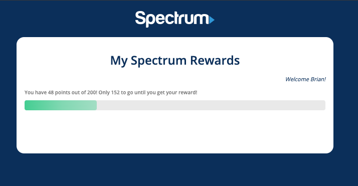

# Spectrum Rewards Demo React Project

A small demo of a Spectrum User Rewards Program.  For this demo I utilized Babel 7, I wrote the Webpack 4 configuration from scratch, Utilized React Context, React Hooks, I created a very simple UI utilizing Spectrums branding, and demonstrated a React Service Pattern (REST).

To view the working demo, clone the repo and run these commands in the working dir:
1. `npm install`
2. `npm start`

*Note: If you see a Python issue with fs-events, it won't stop the application from running.  I believe it just requires Python3+.

Preview:

