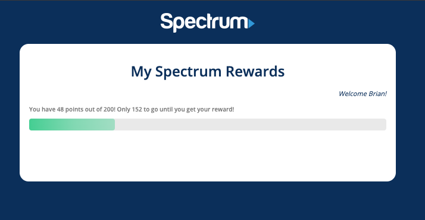

# spectrum-demo

A small demo of a Spectrum User Rewards Program

To view the working demo, clone the repo and run these commands in the working dir:
1. `npm install`
2. `npm start`

*Note: If you see a Python issue with fs-events, it won't stop the application from running.  I believe it just requires Python3+.

Preview:

